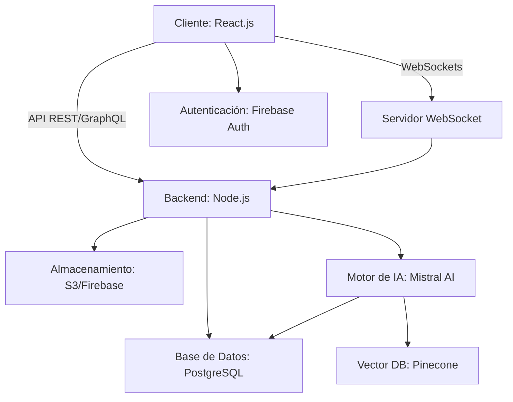
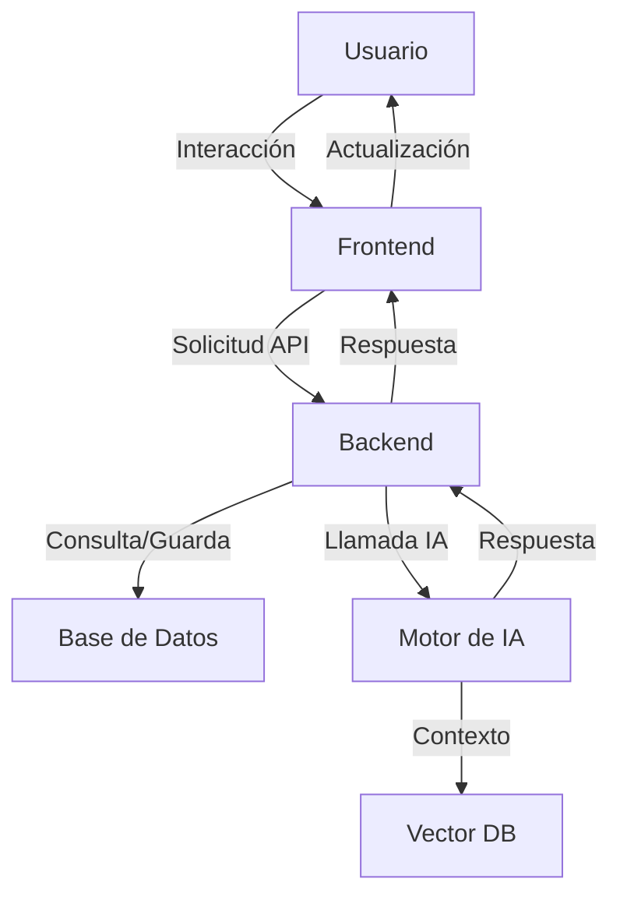
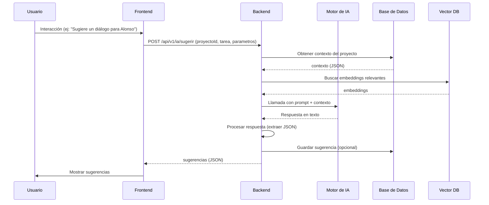
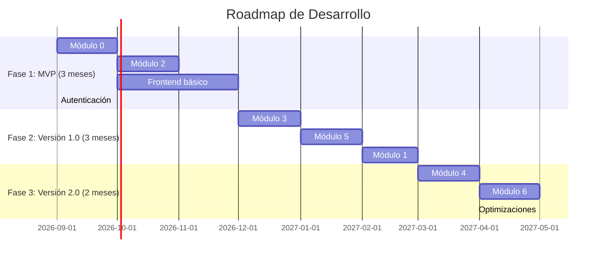

# 📄 **Documento de Diseño Técnico: Aplicación de Narrativa con IA Contextual**
*Especificación Funcional para Arquitectos de Software*

---

## 📌 **1. Introducción y Objetivos**

### **1.1. Propósito del Documento**
Este documento define **funcionalmente** la aplicación de Narrativa con IA Contextual, detallando:
- **Qué hace cada módulo** (funciones y responsabilidades).
- **Qué necesita cada función** (entradas, salidas, dependencias).
- **Estructuras de datos** (esquemas JSON para cada interacción).
- **Recomendaciones técnicas** (tecnologías, arquitectura, buenas prácticas).

**Objetivo final**: Permitir a un **arquitecto de software** desglosar el proyecto en tareas asignables a desarrolladores, con claridad sobre el alcance, los datos y las integraciones.

---

### **1.2. Descripción General del Producto**
**Nombre**: **Narrativa AI** (o nombre a definir).
**Tipo**: Aplicación web **colaborativa** para el desarrollo de proyectos narrativos (guiones, novelas, series, etc.).
**Diferencial**: **IA Contextual** que actúa como co-guionista, entendiendo el contexto completo del proyecto y generando sugerencias coherentes con la teoría narrativa.

**Público objetivo**:
- Guionistas profesionales y aficionados.
- Productores y equipos de desarrollo de contenido.
- Escritores de novelas o historias estructuradas.
- Equipos de producción audiovisual.

**Plataforma**: Web (responsive para móvil/tablet).
**Modelo de negocio**: Suscripción (freemium o premium).

---

### **1.3. Alcance del Proyecto**

#### **📌 Incluye**
✅ Desarrollo completo de proyectos narrativos desde la idea hasta la producción.
✅ IA Contextual integrada en **cada paso del flujo de trabajo**.
✅ Herramientas de colaboración en tiempo real.
✅ Gestión de versiones y historial.
✅ Exportación a formatos estándar (Final Draft, PDF, etc.).
✅ Análisis de métricas y feedback.

#### **📌 No incluye** (fuera de alcance inicial)
❌ Producción audiovisual real (rodaje, edición de video).
❌ Integración con cámaras o equipos físicos.
❌ Distribución de contenido (plataformas como Netflix).
❌ IA generativa de imágenes/vídeo (solo texto y análisis).

---

### **1.4. Glosario de Términos**
| Término | Definición |
|---------|------------|
| **IA Contextual** | Motor de inteligencia artificial que entiende el contexto del proyecto (personajes, tramas, tono, etc.) y genera sugerencias coherentes. |
| **Beat** | Momento clave en la estructura narrativa (ej: "Llamado a la Aventura" en el Viaje del Héroe). |
| **Beat Sheet** | Lista de *beats* que conforman la estructura de una historia. |
| **Shot List** | Lista de planos (tomas) necesarios para rodar una escena. |
| **USP** | *Unique Selling Proposition*: Elemento único que diferencia el proyecto. |
| **Plot Hole** | Inconsistencia en la trama (ej: un personaje sabe algo que no debería saber). |
| **Arc** | Arco de transformación de un personaje (ej: de "Inocente" a "Sabio"). |
| **Mood Board** | Tablero visual con referencias de estilo, color y tono. |

---

---

## 🏗️ **2. Arquitectura General**

### **2.1. Diagrama de Arquitectura**


### **2.2. Componentes Principales**

| Componente | Tecnología | Responsabilidad |
|-----------|------------|-----------------|
| **Frontend** | React.js + TypeScript | Interfaz de usuario, interacción con el usuario. |
| **Backend** | Node.js (NestJS/Express) | Lógica de negocio, API, integración con IA. |
| **Base de Datos** | PostgreSQL (relacional) + MongoDB (NoSQL) | Almacenamiento de proyectos, usuarios, contexto. |
| **Almacenamiento** | AWS S3 / Firebase Storage | Archivos (storyboards, guiones, imágenes). |
| **Autenticación** | Firebase Auth / Auth0 | Gestión de usuarios y permisos. |
| **Motor de IA** | Mistral AI API / Hugging Face | Generación de sugerencias contextualizadas. |
| **Vector DB** | Pinecone / Weaviate | Almacenamiento de embeddings para búsqueda semántica. |
| **WebSockets** | Socket.io | Colaboración en tiempo real (chat, edición). |
| **Búsqueda** | Elasticsearch / Algolia | Búsqueda de proyectos, personajes, escenas. |

---

### **2.3. Flujo de Datos General**


---

### **2.4. Módulos Funcionales**
La aplicación se divide en **7 módulos principales**, cada uno con funciones específicas:

| Módulo | Descripción | Dependencias |
|--------|-------------|--------------|
| **Módulo 0: Motor de IA Contextual** | Cerebro de la aplicación. Gestiona el contexto y genera sugerencias coherentes. | Motor de IA, Vector DB, Base de Datos |
| **Módulo 1: Ideación** | Generación y desarrollo de ideas iniciales (*loglines*, *pitches*, conceptos). | Módulo 0 |
| **Módulo 2: Desarrollo Narrativo** | Estructura, personajes, tramas y escenas. | Módulo 0 |
| **Módulo 3: Pre-Producción** | *Script breakdown*, storyboard, guion técnico. | Módulo 0, Módulo 2 |
| **Módulo 4: Producción** | Planificación, ejecución y post-producción por escenas. | Módulo 0, Módulo 3 |
| **Módulo 5: Colaboración** | Trabajo en equipo, comentarios, control de versiones. | Módulo 0, WebSockets |
| **Módulo 6: Análisis** | Métricas, feedback, informes. | Módulo 0, Módulo 4 |

---

---

## 🔧 **3. Diseño Funcional por Módulo**

---

### **📌 Módulo 0: Motor de IA Contextual**
**Descripción**: Módulo central que **almacena el contexto del proyecto** y **genera sugerencias coherentes** para todos los demás módulos.
**Prioridad**: **Crítica** (sin este módulo, la IA no puede funcionar).

---

#### **🔹 Funciones del Módulo 0**

| Función | Descripción | Entradas | Salidas | Dependencias |
|---------|-------------|---------|---------|--------------|
| **`guardarContextoProyecto`** | Almacena o actualiza el contexto completo de un proyecto. | `proyectoId`, `contexto` (JSON) | `success: boolean`, `version: string` | Base de Datos, Vector DB |
| **`obtenerContextoProyecto`** | Recupera el contexto de un proyecto para una tarea específica. | `proyectoId`, `tarea` (opcional) | `contexto` (JSON filtrado) | Base de Datos |
| **`generarSugerencia`** | Genera una sugerencia contextualizada para una tarea. | `proyectoId`, `tarea`, `parametros` | `sugerencias` (JSON) | Motor de IA, Vector DB |
| **`validarCoherencia`** | Valida que un elemento (personaje, escena, etc.) sea coherente con el contexto. | `proyectoId`, `elemento`, `tipo` | `validaciones` (JSON) | Motor de IA |
| **`aprenderDeFeedback`** | Actualiza el modelo de IA basado en feedback del usuario. | `proyectoId`, `sugerenciaId`, `feedback` (✅/❌), `comentario` | `success: boolean` | Vector DB |

---

#### **🔹 Estructuras de Datos**

##### **Contexto del Proyecto (JSON Schema)**
```json
{
  "$schema": "http://json-schema.org/draft-07/schema#",
  "type": "object",
  "properties": {
    "proyectoId": { "type": "string", "format": "uuid" },
    "titulo": { "type": "string" },
    "genero": {
      "type": "object",
      "properties": {
        "principal": { "type": "string", "enum": ["Drama", "Comedia", "Fantasía", "Ciencia Ficción", "Terror", "Aventura", "Romance", "Thriller", "Noir", "Fantasía Oscura", "Histórico"] },
        "secundarios": { "type": "array", "items": { "type": "string" } }
      },
      "required": ["principal"]
    },
    "tono": {
      "type": "object",
      "properties": {
        "principal": { "type": "string", "enum": ["Melancólico", "Alegre", "Oscuro", "Ligero", "Irónico", "Solemne", "Caótico", "Sereno"] },
        "matizes": { "type": "array", "items": { "type": "string" } }
      },
      "required": ["principal"]
    },
    "temas": {
      "type": "array",
      "items": {
        "type": "object",
        "properties": {
          "nombre": { "type": "string" },
          "desarrollo": { "type": "string" },
          "simbolo": { "type": "string" }
        },
        "required": ["nombre"]
      }
    },
    "mensaje_central": { "type": "string" },
    "publico_objetivo": {
      "type": "object",
      "properties": {
        "edad": { "type": "string" },
        "intereses": { "type": "array", "items": { "type": "string" } }
      }
    },
    "personajes": {
      "type": "array",
      "items": { "$ref": "#/definitions/personaje" }
    },
    "tramas": {
      "type": "array",
      "items": { "$ref": "#/definitions/trama" }
    },
    "escenas": {
      "type": "array",
      "items": { "$ref": "#/definitions/escena" }
    },
    "modelo_estructural": {
      "type": "string",
      "enum": ["Viaje del Héroe", "3 Actos", "Save the Cat", "Pirámide de Freytag", "Estructura Circular", "Estructura en Paralelo"]
    },
    "beat_sheet": {
      "type": "array",
      "items": { "$ref": "#/definitions/beat" }
    },
    "metadata": {
      "type": "object",
      "properties": {
        "creado_en": { "type": "string", "format": "date-time" },
        "actualizado_en": { "type": "string", "format": "date-time" },
        "version": { "type": "string" },
        "autor": { "type": "string" }
      }
    }
  },
  "definitions": {
    "personaje": {
      "type": "object",
      "properties": {
        "id": { "type": "string", "format": "uuid" },
        "nombre": { "type": "string" },
        "arquetipo": { "type": "string" },
        "objetivo": { "type": "string" },
        "conflicto_interno": { "type": "string" },
        "arco_transformacion": {
          "type": "object",
          "properties": {
            "de": { "type": "string" },
            "a": { "type": "string" }
          },
          "required": ["de", "a"]
        },
        "relaciones": {
          "type": "array",
          "items": {
            "type": "object",
            "properties": {
              "personaje_id": { "type": "string", "format": "uuid" },
              "tipo": { "type": "string", "enum": ["Aliado", "Enemigo", "Mentor", "Amor", "Familiar"] },
              "tension": { "type": "string" }
            },
            "required": ["personaje_id", "tipo"]
          }
        }
      },
      "required": ["id", "nombre"]
    },
    "trama": {
      "type": "object",
      "properties": {
        "id": { "type": "string", "format": "uuid" },
        "tipo": { "type": "string", "enum": ["Principal", "Secundaria", "Temática"] },
        "descripcion": { "type": "string" },
        "puntos_clave": { "type": "array", "items": { "type": "string" } }
      },
      "required": ["id", "tipo", "descripcion"]
    },
    "escena": {
      "type": "object",
      "properties": {
        "id": { "type": "string", "format": "uuid" },
        "titulo": { "type": "string" },
        "trama_id": { "type": "string", "format": "uuid" },
        "objetivo": { "type": "string" },
        "conflicto": { "type": "string" },
        "personajes": { "type": "array", "items": { "type": "string", "format": "uuid" } },
        "tono": { "type": "string" }
      },
      "required": ["id", "titulo"]
    },
    "beat": {
      "type": "object",
      "properties": {
        "numero": { "type": "integer" },
        "nombre": { "type": "string" },
        "descripcion": { "type": "string" },
        "escena_asociada": { "type": "string", "format": "uuid" }
      },
      "required": ["numero", "nombre"]
    }
  },
  "required": ["proyectoId", "titulo"]
}
```

##### **Sugerencia de la IA (JSON Schema)**
```json
{
  "$schema": "http://json-schema.org/draft-07/schema#",
  "type": "object",
  "properties": {
    "id": { "type": "string", "format": "uuid" },
    "tipo": { "type": "string", "enum": ["logline", "pitch", "arquetipo", "dialogo", "beat", "escena", "shot_list", "recurso", "validacion"] },
    "contexto": {
      "type": "object",
      "properties": {
        "proyecto_id": { "type": "string", "format": "uuid" },
        "tarea": { "type": "string" },
        "elemento_id": { "type": "string", "format": "uuid" }
      }
    },
    "contenido": { "type": "object" },
    "justificacion": { "type": "string" },
    "puntuacion": { "type": "number", "minimum": 0, "maximum": 1 },
    "alternativas": { "type": "array", "items": { "type": "object" } },
    "validaciones": { "type": "array", "items": { "$ref": "#/definitions/validacion" } },
    "metadata": {
      "type": "object",
      "properties": {
        "generado_en": { "type": "string", "format": "date-time" },
        "modelo_ia": { "type": "string" }
      }
    }
  },
  "definitions": {
    "validacion": {
      "type": "object",
      "properties": {
        "campo": { "type": "string" },
        "resultado": { "type": "string", "enum": ["✅", "⚠️", "❌"] },
        "nota": { "type": "string" }
      },
      "required": ["campo", "resultado"]
    }
  },
  "required": ["id", "tipo", "contexto", "contenido"]
}
```

---

#### **🔹 Recomendaciones de Implementación**

##### **Base de Datos (PostgreSQL)**
- **Tabla `proyectos`**:
  ```sql
  CREATE TABLE proyectos (
    id UUID PRIMARY KEY,
    titulo VARCHAR(255) NOT NULL,
    genero JSONB NOT NULL, -- { principal: "Fantasía", secundarios: [...] }
    tono JSONB NOT NULL,
    temas JSONB NOT NULL,
    mensaje_central TEXT,
    modelo_estructural VARCHAR(50),
    beat_sheet JSONB,
    usuario_id UUID REFERENCES usuarios(id),
    creado_en TIMESTAMP WITH TIME ZONE DEFAULT NOW(),
    actualizado_en TIMESTAMP WITH TIME ZONE DEFAULT NOW()
  );
  ```

- **Tabla `personajes`**:
  ```sql
  CREATE TABLE personajes (
    id UUID PRIMARY KEY,
    proyecto_id UUID REFERENCES proyectos(id) ON DELETE CASCADE,
    nombre VARCHAR(255) NOT NULL,
    arquetipo VARCHAR(50),
    objetivo TEXT,
    conflicto_interno TEXT,
    arco_transformacion JSONB, -- { de: "...", a: "..." }
    relaciones JSONB, -- [{ personaje_id: "...", tipo: "...", tension: "..." }]
    detalles JSONB -- { frase_caracteristica: [...], simbolo: "..." }
  );
  ```

- **Tabla `escenas`**:
  ```sql
  CREATE TABLE escenas (
    id UUID PRIMARY KEY,
    proyecto_id UUID REFERENCES proyectos(id) ON DELETE CASCADE,
    titulo VARCHAR(255),
    trama_id UUID REFERENCES tramas(id),
    objetivo TEXT,
    conflicto TEXT,
    personajes UUID[], -- Array de IDs de personajes
    tono VARCHAR(50),
    orden INTEGER
  );
  ```

- **Tabla `sugerencias_ia`** (para feedback):
  ```sql
  CREATE TABLE sugerencias_ia (
    id UUID PRIMARY KEY,
    proyecto_id UUID REFERENCES proyectos(id) ON DELETE CASCADE,
    tipo VARCHAR(50) NOT NULL,
    contexto JSONB NOT NULL,
    contenido JSONB NOT NULL,
    puntuacion FLOAT,
    feedback BOOLEAN, -- true = ✅, false = ❌
    comentario TEXT,
    generado_en TIMESTAMP WITH TIME ZONE DEFAULT NOW()
  );
  ```

##### **Vector DB (Pinecone/Weaviate)**
- **Índice `proyectos_embeddings`**:
  - Almacena embeddings de:
    - Títulos de proyectos.
    - Descripciones de personajes.
    - Diálogos.
    - Temas y mensajes centrales.
  - **Uso**: Búsqueda semántica para sugerencias contextualizadas.

##### **Motor de IA (Mistral AI)**
- **Prompt de sistema base**:
  ```
  Eres Narrativa AI, un co-guionista experto en teoría narrativa. Tu tarea es ayudar al usuario a desarrollar su proyecto de manera coherente y creativa.
  
  **Reglas generales**:
  1. Siempre usa el contexto del proyecto para generar sugerencias.
  2. Tus respuestas deben ser específicas y útiles, nunca genéricas.
  3. Justifica cada sugerencia explicando por qué encaja con el proyecto.
  4. Ofrece al menos 3 alternativas cuando sea relevante.
  5. Si detectas una inconsistencia, señálalo claramente.
  
  **Contexto del proyecto actual**:
  {contexto_proyecto}
  
  **Tarea actual**:
  {tarea}
  
  **Elemento actual (si aplica)**:
  {elemento}
  ```

- **Integración**:
  - Usar la API de Mistral con `temperature=0.3` (para respuestas más deterministas).
  - Incluir el contexto del proyecto en el `system prompt`.
  - Validar las respuestas antes de devolverlas al usuario.

---

#### **🔹 Endpoints del Módulo 0**

| Endpoint | Método | Descripción | Parámetros | Respuesta |
|----------|--------|-------------|------------|-----------|
| `/api/v1/contexto/proyectos/{id}` | GET | Obtiene el contexto de un proyecto. | `id` (UUID) | `contexto` (JSON) |
| `/api/v1/contexto/proyectos/{id}` | PUT | Actualiza el contexto de un proyecto. | `id`, `contexto` (JSON) | `success`, `version` |
| `/api/v1/ia/sugerir` | POST | Genera una sugerencia contextualizada. | `proyecto_id`, `tarea`, `parametros` | `sugerencias` (JSON) |
| `/api/v1/ia/validar` | POST | Valida la coherencia de un elemento. | `proyecto_id`, `elemento`, `tipo` | `validaciones` (JSON) |
| `/api/v1/ia/feedback` | POST | Registra feedback sobre una sugerencia. | `sugerencia_id`, `feedback`, `comentario` | `success` |

---

#### **🔹 Diagrama de Secuencia del Módulo 0**


---

---

### **📌 Módulo 1: Ideación**
**Descripción**: Herramientas para la **fase inicial** del proyecto: generación de ideas, desarrollo del concepto e investigación.
**Dependencias**: Módulo 0 (IA Contextual).

---

#### **🔹 Funciones del Módulo 1**

| Función | Descripción | Entradas | Salidas | IA Contextual |
|---------|-------------|---------|---------|---------------|
| **`generarLoglines`** | Genera *loglines* basados en género, tono y temas. | `proyectoId`, `genero`, `tono`, `temas` | `loglines` (array) | ✅ |
| **`generarPitches`** | Crea *pitches* (elevator pitch, one-pager). | `proyectoId`, `tipo` (elevator/one-pager) | `pitches` (array) | ✅ |
| **`analizarGapMercado`** | Identifica oportunidades en el mercado. | `proyectoId`, `genero`, `temas` | `gap_analisis` (JSON) | ✅ |
| **`validarConcepto`** | Valida coherencia entre elementos del concepto. | `proyectoId` | `validaciones` (array) | ✅ |
| **`generarMoodBoard`** | Sugiere paleta de colores y referencias visuales. | `proyectoId`, `tono`, `genero` | `mood_board` (JSON) | ✅ |
| **`generarContextoHistorico`** | Proporciona datos históricos relevantes. | `proyectoId`, `periodo` | `contexto_historico` (JSON) | ✅ |
| **`sugerirArquetipos`** | Recomienda arquetipos para personajes. | `proyectoId`, `genero`, `tono` | `arquetipos` (array) | ✅ |

---

#### **🔹 Estructuras de Datos**

##### **Logline (JSON Schema)**
```json
{
  "type": "object",
  "properties": {
    "id": { "type": "string", "format": "uuid" },
    "texto": { "type": "string" },
    "puntuacion": { "type": "number", "minimum": 0, "maximum": 1 },
    "justificacion": {
      "type": "object",
      "properties": {
        "genero": { "type": "string" },
        "tono": { "type": "string" },
        "temas": { "type": "array", "items": { "type": "string" } },
        "elementos_aristotelicos": {
          "type": "object",
          "properties": {
            "mythos": { "type": "string" },
            "ethos": { "type": "string" },
            "dianoia": { "type": "string" },
            "lexis": { "type": "string" },
            "opsis": { "type": "string" },
            "melos": { "type": "string" }
          }
        }
      }
    }
  },
  "required": ["id", "texto", "justificacion"]
}
```

##### **Mood Board (JSON Schema)**
```json
{
  "type": "object",
  "properties": {
    "paleta_colores": {
      "type": "object",
      "properties": {
        "primarios": { "type": "array", "items": { "type": "string", "format": "hexcolor" } },
        "secundarios": { "type": "array", "items": { "type": "string", "format": "hexcolor" } },
        "justificacion": { "type": "string" }
      },
      "required": ["primarios", "secundarios"]
    },
    "referencias_visuales": {
      "type": "array",
      "items": {
        "type": "object",
        "properties": {
          "titulo": { "type": "string" },
          "url": { "type": "string", "format": "uri" },
          "descripcion": { "type": "string" },
          "tono": { "type": "string" }
        },
        "required": ["titulo", "descripcion"]
      }
    },
    "estilo_artistico": {
      "type": "object",
      "properties": {
        "descripcion": { "type": "string" },
        "ejemplos": { "type": "array", "items": { "type": "string" } }
      }
    }
  },
  "required": ["paleta_colores", "referencias_visuales"]
}
```

---

#### **🔹 Endpoints del Módulo 1**

| Endpoint | Método | Descripción | Parámetros | Respuesta |
|----------|--------|-------------|------------|-----------|
| `/api/v1/ideacion/loglines` | POST | Genera *loglines* para un proyecto. | `proyectoId`, `genero`, `tono`, `temas` | `loglines` (array) |
| `/api/v1/ideacion/pitches` | POST | Genera *pitches* para un proyecto. | `proyectoId`, `tipo` | `pitches` (array) |
| `/api/v1/ideacion/gap-analisis` | POST | Analiza *gaps* en el mercado. | `proyectoId` | `gap_analisis` (JSON) |
| `/api/v1/ideacion/validar-concepto` | POST | Valida el concepto del proyecto. | `proyectoId` | `validaciones` (array) |
| `/api/v1/ideacion/mood-board` | POST | Genera un *mood board*. | `proyectoId` | `mood_board` (JSON) |
| `/api/v1/ideacion/contexto-historico` | POST | Genera contexto histórico. | `proyectoId`, `periodo` | `contexto_historico` (JSON) |

---

#### **🔹 Recomendaciones de Implementación**
- **Frontend**:
  - Usar un **editor de texto enriquecido** (ej: ProseMirror) para los *pitches*.
  - **Visualización de paletas de color**: Librería como `react-color`.
  - **Galeria de referencias visuales**: Grid de imágenes con *drag and drop*.
- **Backend**:
  - **Generación de *loglines***: Usar el Módulo 0 para llamar a la IA con el contexto.
  - **Análisis de *gap* de mercado**: Comparar con una base de datos de proyectos existentes (ej: IMDb API).
  - **Cachear resultados**: Los *mood boards* y contexto histórico pueden cachearse por proyecto.

---

---

### **📌 Módulo 2: Desarrollo Narrativo**
**Descripción**: Herramientas para desarrollar la **estructura, personajes, tramas y escenas** del proyecto.
**Dependencias**: Módulo 0 (IA Contextual).

---

#### **🔹 Submódulo 2.1: Estructura Global**

| Función | Descripción | Entradas | Salidas | IA Contextual |
|---------|-------------|---------|---------|---------------|
| **`recomendarModeloEstructural`** | Sugiere el modelo estructural más adecuado. | `proyectoId` | `modelo_recomendado` (JSON) | ✅ |
| **`generarBeatSheet`** | Crea un *beat sheet* inicial. | `proyectoId`, `modelo` | `beat_sheet` (JSON) | ✅ |
| **`validarBeatSheet`** | Detecta *beats* ausentes o mal ubicados. | `proyectoId`, `beat_sheet` | `validaciones` (array) | ✅ |
| **`optimizarRitmo`** | Sugiere ajustes para mejorar el ritmo. | `proyectoId`, `beat_sheet` | `recomendaciones` (array) | ✅ |

**Estructura de Datos: Beat Sheet**
```json
{
  "modelo": "Viaje del Héroe",
  "beats": [
    {
      "numero": 1,
      "nombre": "Mundo Ordinario",
      "descripcion": "Alonso vive en el faro, sin recordar su pasado.",
      "escena_asociada": "e1",
      "personajes": ["p1"],
      "tono": "melancólico",
      "duracion_estimada": "5 min",
      "validacion_ia": {
        "coherencia": true,
        "notas": "✅ Bien definido."
      }
    }
  ],
  "beats_faltantes": [
    {
      "nombre": "Acercamiento a la Cueva Oscura",
      "justificacion": "Este beat es clave para preparar la Prueba Suprema."
    }
  ],
  "ritmo": {
    "actual": "Lento en el Acto 1",
    "recomendaciones": ["Añadir una escena de acción en el beat 6."]
  }
}
```

**Endpoints**:
| Endpoint | Método | Descripción |
|----------|--------|-------------|
| `/api/v1/estructura/recomendar-modelo` | POST | Recomienda modelo estructural. |
| `/api/v1/estructura/beat-sheet` | POST | Genera *beat sheet*. |
| `/api/v1/estructura/validar` | POST | Valida *beat sheet*. |

---

#### **🔹 Submódulo 2.2: Desarrollo de Personajes**

| Función | Descripción | Entradas | Salidas | IA Contextual |
|---------|-------------|---------|---------|---------------|
| **`sugerirArquetipo`** | Recomienda arquetipos para un personaje. | `proyectoId`, `personajeId` | `arquetipos` (array) | ✅ |
| **`generarFichaPersonaje`** | Completa una ficha de personaje. | `proyectoId`, `personajeId` | `ficha_personaje` (JSON) | ✅ |
| **`sugerirArcos`** | Propone arcos de transformación. | `proyectoId`, `personajeId` | `arcos` (array) | ✅ |
| **`generarDialogos`** | Crea diálogos para un personaje. | `proyectoId`, `personajeId`, `contexto` | `dialogos` (array) | ✅ |
| **`sugerirRelaciones`** | Propone relaciones entre personajes. | `proyectoId`, `personajeId` | `relaciones` (array) | ✅ |
| **`validarPersonaje`** | Detecta inconsistencias en un personaje. | `proyectoId`, `personajeId` | `validaciones` (array) | ✅ |

**Estructura de Datos: Ficha de Personaje**
```json
{
  "id": "p1",
  "nombre": "Alonso",
  "arquetipo": {
    "principal": "El Héroe Herido",
    "justificacion": "Encaja con su arco de redención y conflicto interno (culpa)."
  },
  "arco_transformacion": {
    "de": "Inocente (ignora su pasado)",
    "a": "Sabio (acepta su pasado)"
  },
  "dialogos": [
    {
      "contexto": "Confrontación con Don Rafael",
      "texto": "'No merezco perdón.'",
      "tono": "Derrota"
    }
  ],
  "relaciones": [
    {
      "personaje_id": "p2",
      "tipo": "Mentor",
      "tension": "Oculta que fue testigo de sus crímenes."
    }
  ],
  "validaciones": [
    {
      "campo": "arco_transformacion",
      "resultado": "✅",
      "nota": "El arco encaja con el tema de 'pérdida de la inocencia'."
    }
  ]
}
```

**Endpoints**:
| Endpoint | Método | Descripción |
|----------|--------|-------------|
| `/api/v1/personajes/sugerir-arquetipo` | POST | Sugiere arquetipos. |
| `/api/v1/personajes/generar-ficha` | POST | Genera ficha completa. |
| `/api/v1/personajes/sugerir-arcos` | POST | Sugiere arcos. |
| `/api/v1/personajes/generar-dialogos` | POST | Genera diálogos. |
| `/api/v1/personajes/validar` | POST | Valida personaje. |

---

#### **🔹 Submódulo 2.3: Desarrollo de Tramas**

| Función | Descripción | Entradas | Salidas | IA Contextual |
|---------|-------------|---------|---------|---------------|
| **`sugerirTramasSecundarias`** | Propone tramas secundarias. | `proyectoId` | `tramas_secundarias` (array) | ✅ |
| **`detectarPlotHoles`** | Identifica *plot holes* en las tramas. | `proyectoId` | `plot_holes` (array) | ✅ |
| **`optimizarIntersecciones`** | Sugiere puntos de intersección entre tramas. | `proyectoId` | `puntos_interseccion` (array) | ✅ |
| **`validarTramas`** | Valida coherencia entre tramas. | `proyectoId` | `validaciones` (array) | ✅ |

**Estructura de Datos: Tramas**
```json
{
  "tramas": {
    "principal": {
      "id": "t1",
      "descripcion": "Viaje de Alonso para recuperar su memoria."
    },
    "secundarias": [
      {
        "id": "t2",
        "titulo": "La niña del faro",
        "descripcion": "Lucía, una niña que simboliza la inocencia perdida de Alonso.",
        "conexion_con_principal": "Su relación con Lucía lo ayuda a redimirse."
      }
    ],
    "puntos_interseccion": [
      {
        "trama_a": "t1",
        "trama_b": "t2",
        "escena": "e15",
        "descripcion": "Alonso salva a Lucía de un peligro, simbolizando su redención."
      }
    ],
    "plot_holes": [
      {
        "escena": "e12",
        "problema": "Alonso actúa como si supiera la verdad, pero no se revela hasta e15.",
        "soluciones": [
          "Añadir una escena de revelación parcial en e10.",
          "Ajustar los diálogos en e12 para que Alonso solo sospeche."
        ]
      }
    ]
  }
}
```

**Endpoints**:
| Endpoint | Método | Descripción |
|----------|--------|-------------|
| `/api/v1/tramas/sugerir-secundarias` | POST | Sugiere tramas secundarias. |
| `/api/v1/tramas/detectar-plot-holes` | POST | Detecta *plot holes*. |
| `/api/v1/tramas/optimizar-intersecciones` | POST | Optimiza intersecciones. |

---

#### **🔹 Submódulo 2.4: Desarrollo de Escenas**

| Función | Descripción | Entradas | Salidas | IA Contextual |
|---------|-------------|---------|---------|---------------|
| **`sugerirObjetivosEscena`** | Propone objetivos para una escena. | `proyectoId`, `escenaId` | `objetivos` (array) | ✅ |
| **`generarDialogosEscena`** | Crea diálogos para una escena. | `proyectoId`, `escenaId` | `dialogos` (array) | ✅ |
| **`sugerirShots`** | Recomienda *shots* para una escena. | `proyectoId`, `escenaId` | `shots` (array) | ✅ |
| **`validarRitmoEscenas`** | Analiza el ritmo de una secuencia de escenas. | `proyectoId` | `ritmo` (JSON) | ✅ |

**Estructura de Datos: Escena**
```json
{
  "id": "e5",
  "objetivos": [
    {
      "texto": "Establecer la relación de tensión entre Alonso y Don Rafael.",
      "justificacion": "Este es su primer encuentro significativo."
    }
  ],
  "dialogos": [
    {
      "personaje": "p1",
      "texto": "'¿Cuántas mentiras más debo escuchar, Don Rafael?'",
      "tono": "Frustración"
    }
  ],
  "shots": [
    {
      "tipo": "Plano medio",
      "descripcion": "Ambos personajes sentados en el faro.",
      "duracion": "5 segundos"
    }
  ],
  "ritmo": {
    "actual": "Lento (diálogo intenso)",
    "recomendado": "Añadir un *shot* de acción."
  }
}
```

**Endpoints**:
| Endpoint | Método | Descripción |
|----------|--------|-------------|
| `/api/v1/escenas/sugerir-objetivos` | POST | Sugiere objetivos. |
| `/api/v1/escenas/generar-dialogos` | POST | Genera diálogos. |
| `/api/v1/escenas/sugerir-shots` | POST | Sugiere *shots*. |
| `/api/v1/escenas/validar-ritmo` | POST | Valida ritmo. |

---

#### **🔹 Recomendaciones de Implementación para Módulo 2**
- **Frontend**:
  - **Editor de *beat sheet***: Tabla interactiva con *drag and drop* para reordenar *beats*.
  - **Ficha de personaje**: Formulario dinámico con campos opcionales/obligatorios.
  - **Visualización de tramas**: Diagrama de flujo (Mermaid.js) para ver intersecciones.
  - **Editor de escenas**: Vista de tarjetas (kanban) para organizar escenas por trama.
- **Backend**:
  - **Validación en tiempo real**: Usar WebSockets para validar cambios mientras el usuario escribe.
  - **Cachear sugerencias**: Las sugerencias de la IA pueden cachearse por `proyectoId + tarea`.
  - **Historial de versiones**: Guardar versiones de *beat sheets*, personajes y tramas.

---

---

### **📌 Módulo 3: Pre-Producción**
**Descripción**: Herramientas para preparar el proyecto para la producción: *script breakdown*, storyboard y guion técnico.
**Dependencias**: Módulo 0 (IA Contextual), Módulo 2 (Desarrollo Narrativo).

---

#### **🔹 Submódulo 3.1: Script Breakdown**

| Función | Descripción | Entradas | Salidas | IA Contextual |
|---------|-------------|---------|---------|---------------|
| **`generarScriptBreakdown`** | Desglosa el guion por escenas. | `proyectoId` | `script_breakdown` (JSON) | ✅ |
| **`generarShotList`** | Crea una *shot list* para una escena. | `proyectoId`, `escenaId` | `shot_list` (array) | ✅ |
| **`calcularRecursos`** | Estima recursos necesarios por escena. | `proyectoId`, `escenaId` | `recursos` (JSON) | ✅ |
| **`optimizarLocaciones`** | Agrupa escenas por locación. | `proyectoId` | `locaciones_optimizadas` (array) | ✅ |

**Estructura de Datos: Script Breakdown**
```json
{
  "escenas": [
    {
      "id": "e1",
      "titulo": "El farol apagado",
      "shot_list": [
        {
          "tipo": "Plano general",
          "descripcion": "El faro en la colina, con el mar de fondo.",
          "duracion": "5 seg"
        }
      ],
      "recursos": {
        "props": ["Farol", "Carta vieja"],
        "vestuario": ["Abrigo de Alonso"],
        "efx": ["Luz tenue"]
      }
    }
  ],
  "locaciones_optimizadas": [
    {
      "locacion": "Faro",
      "escenas": ["e1", "e3", "e5"]
    }
  ]
}
```

**Endpoints**:
| Endpoint | Método | Descripción |
|----------|--------|-------------|
| `/api/v1/preproduccion/script-breakdown` | POST | Genera *script breakdown*. |
| `/api/v1/preproduccion/shot-list` | POST | Genera *shot list*. |
| `/api/v1/preproduccion/recursos` | POST | Calcula recursos. |
| `/api/v1/preproduccion/optimizar-locaciones` | POST | Optimiza locaciones. |

---

#### **🔹 Submódulo 3.2: Storyboard**

| Función | Descripción | Entradas | Salidas | IA Contextual |
|---------|-------------|---------|---------|---------------|
| **`generarStoryboard`** | Crea un storyboard para una escena. | `proyectoId`, `escenaId` | `storyboard` (JSON) | ✅ |
| **`sugerirEncuadre`** | Recomienda encuadre y composición. | `proyectoId`, `escenaId` | `encuadre` (JSON) | ✅ |
| **`sugerirPaletaColores`** | Propone paleta de colores para una escena. | `proyectoId`, `escenaId` | `paleta_colores` (JSON) | ✅ |

**Estructura de Datos: Storyboard**
```json
{
  "escena_id": "e5",
  "viñetas": [
    {
      "numero": 1,
      "encuadre": "Plano general",
      "composicion": "Alonso y Don Rafael sentados en el faro, con el mar de fondo (regla de los tercios).",
      "movimiento": "Estático",
      "iluminacion": "Luz tenue del farol (clave baja).",
      "paleta_colores": ["#1A2332", "#D4AF37"],
      "duracion": "5 seg"
    }
  ]
}
```

**Endpoints**:
| Endpoint | Método | Descripción |
|----------|--------|-------------|
| `/api/v1/preproduccion/storyboard` | POST | Genera storyboard. |
| `/api/v1/preproduccion/sugerir-encuadre` | POST | Sugiere encuadre. |

---

#### **🔹 Submódulo 3.3: Guion Técnico**

| Función | Descripción | Entradas | Salidas | IA Contextual |
|---------|-------------|---------|---------|---------------|
| **`validarFormatoGuion`** | Valida el formato del guion. | `proyectoId`, `guion` (texto) | `validaciones` (array) | ✅ |
| **`mejorarAcciones`** | Sugiere acciones más descriptivas. | `proyectoId`, `accion` (texto) | `acciones_mejoradas` (array) | ✅ |
| **`generarNotasDireccion`** | Crea notas de dirección. | `proyectoId`, `escenaId` | `notas_direccion` (array) | ✅ |
| **`exportarGuion`** | Exporta el guion a Final Draft/PDF. | `proyectoId`, `formato` | `file` (binario) | ❌ |

**Estructura de Datos: Validación de Guion**
```json
{
  "validaciones_formato": [
    {
      "error": "Falta encabezado de escena",
      "correccion": "Usa 'INT. FARO - NOCHE' en lugar de 'Escena 5: Faro'.",
      "linea": 10
    }
  ],
  "acciones_mejoradas": [
    {
      "original": "Alonso está triste.",
      "sugerencia": "Alonso se frota los ojos con los nudillos, como si pudiera borrar las imágenes de su mente."
    }
  ],
  "notas_direccion": [
    {
      "texto": "(Alonso mira al suelo, voz quebrada. Pausa larga antes de la siguiente línea.)",
      "contexto": "Diálogo emocional en e5."
    }
  ]
}
```

**Endpoints**:
| Endpoint | Método | Descripción |
|----------|--------|-------------|
| `/api/v1/preproduccion/validar-guion` | POST | Valida formato. |
| `/api/v1/preproduccion/mejorar-acciones` | POST | Mejora acciones. |
| `/api/v1/preproduccion/notas-direccion` | POST | Genera notas. |
| `/api/v1/preproduccion/exportar` | POST | Exporta guion. |

---

#### **🔹 Recomendaciones de Implementación para Módulo 3**
- **Frontend**:
  - **Editor de *script breakdown***: Tabla con columnas para cada recurso (props, vestuario, EFX).
  - **Herramienta de storyboard**: Lienzo interactivo con *drag and drop* para viñetas.
  - **Editor de guion**: Usar una librería como `react-simple-code-editor` con resaltado de sintaxis para formato de guion.
  - **Exportación**: Usar librerías como `pdf-lib` para PDF y `final-draft-xml` para Final Draft.
- **Backend**:
  - **Generación de *shot lists***: Usar reglas basadas en el tipo de escena (ej: diálogo → plano medio + primer plano).
  - **Optimización de locaciones**: Algoritmo de clustering para agrupar escenas por locación.

---

---

### **📌 Módulo 4: Producción**
**Descripción**: Herramientas para la **ejecución** del proyecto: planificación, rodaje y post-producción.
**Dependencias**: Módulo 0 (IA Contextual), Módulo 3 (Pre-Producción).

---

#### **🔹 Submódulo 4.1: Planificación de Producción**

| Función | Descripción | Entradas | Salidas | IA Contextual |
|---------|-------------|---------|---------|---------------|
| **`generarCalendarioRodaje`** | Crea un calendario de rodaje optimizado. | `proyectoId` | `calendario` (JSON) | ✅ |
| **`asignarRecursos`** | Asigna recursos a escenas. | `proyectoId` | `asignacion_recursos` (JSON) | ✅ |
| **`calcularPresupuesto`** | Estima el presupuesto por escena. | `proyectoId` | `presupuesto` (JSON) | ✅ |
| **`generarAlertasPresupuesto`** | Detecta excedentes de presupuesto. | `proyectoId` | `alertas` (array) | ✅ |

**Estructura de Datos: Calendario de Rodaje**
```json
{
  "dias": [
    {
      "fecha": "2026-09-01",
      "escenas": [
        {
          "id": "e1",
          "titulo": "El farol apagado",
          "duracion_estimada": "2 horas"
        }
      ],
      "locacion": "Faro",
      "recursos": {
        "actores": ["p1", "p2"],
        "equipamiento": ["Cámara A", "Micrófono B"]
      }
    }
  ],
  "alertas_presupuesto": [
    {
      "escena": "e10",
      "exceso": "€500",
      "sugerencia": "Reducir extras o usar locación más económica."
    }
  ]
}
```

**Endpoints**:
| Endpoint | Método | Descripción |
|----------|--------|-------------|
| `/api/v1/produccion/calendario` | POST | Genera calendario. |
| `/api/v1/produccion/asignar-recursos` | POST | Asigna recursos. |
| `/api/v1/produccion/presupuesto` | POST | Calcula presupuesto. |

---

#### **🔹 Submódulo 4.2: Ejecución por Escena**

| Función | Descripción | Entradas | Salidas | IA Contextual |
|---------|-------------|---------|---------|---------------|
| **`generarShotListEjecucion`** | Crea *shot list* para ejecución. | `proyectoId`, `escenaId` | `shot_list` (array) | ✅ |
| **`validarContinuidad`** | Detecta errores de continuidad. | `proyectoId`, `escenaId`, `tomas` | `continuidad` (array) | ✅ |
| **`analizarProgreso`** | Analiza el progreso del rodaje. | `proyectoId` | `progreso` (JSON) | ✅ |

**Estructura de Datos: Continuidad**
```json
{
  "problemas": [
    {
      "toma": 3,
      "problema": "El reloj de Alonso marca las 3:00, pero en la toma 5 marca las 3:15.",
      "solucion": "Ajustar el reloj en la toma 5 a las 3:00."
    }
  ],
  "progreso": {
    "completado": "60%",
    "escenas_restantes": ["e7", "e8", "e9"],
    "ritmo": "On track (2 días antes de lo planeado)."
  }
}
```

**Endpoints**:
| Endpoint | Método | Descripción |
|----------|--------|-------------|
| `/api/v1/produccion/shot-list` | POST | Genera *shot list*. |
| `/api/v1/produccion/validar-continuidad` | POST | Valida continuidad. |
| `/api/v1/produccion/progreso` | GET | Obtiene progreso. |

---

#### **🔹 Submódulo 4.3: Post-Producción**

| Función | Descripción | Entradas | Salidas | IA Contextual |
|---------|-------------|---------|---------|---------------|
| **`sugerirEdicion`** | Recomienda cortes y ajustes de edición. | `proyectoId`, `escenaId` | `edicion` (JSON) | ✅ |
| **`sugerirColorGrading`** | Propone ajustes de color. | `proyectoId`, `escenaId` | `color_grading` (JSON) | ✅ |
| **`sugerirTransiciones`** | Recomienda transiciones entre escenas. | `proyectoId` | `transiciones` (array) | ✅ |

**Estructura de Datos: Edición**
```json
{
  "edicion": [
    {
      "plano": "Plano 3 (e5)",
      "accion": "cortar",
      "duracion_actual": "5 seg",
      "duracion_recomendada": "3 seg",
      "justificacion": "El ritmo es lento en esta secuencia."
    }
  ],
  "color_grading": {
    "preset": "Noir Clásico",
    "ajustes": [
      "Aumentar contraste",
      "Reducir saturación"
    ]
  },
  "transiciones": [
    {
      "tipo": "FUNDIDO A NEGRO",
      "escenas": ["e5", "e6"],
      "justificacion": "Para marcar el cambio de tono."
    }
  ]
}
```

**Endpoints**:
| Endpoint | Método | Descripción |
|----------|--------|-------------|
| `/api/v1/produccion/sugerir-edicion` | POST | Sugiere edición. |
| `/api/v1/produccion/sugerir-color-grading` | POST | Sugiere *color grading*. |
| `/api/v1/produccion/sugerir-transiciones` | POST | Sugiere transiciones. |

---

#### **🔹 Recomendaciones de Implementación para Módulo 4**
- **Frontend**:
  - **Calendario de rodaje**: Usar una librería como `react-big-calendar` o `fullcalendar`.
  - **Seguimiento de progreso**: Dashboard con gráficos (Chart.js).
  - **Validación de continuidad**: Mostrar *thumbnails* de tomas para comparar visualmente.
- **Backend**:
  - **Optimización de calendario**: Algoritmo de *scheduling* para minimizar cambios de locación.
  - **Detección de continuidad**: Comparar metadatos de tomas (ej: posición de objetos, vestuario).

---

---

### **📌 Módulo 5: Colaboración**
**Descripción**: Herramientas para trabajo en equipo: comentarios, control de versiones y asignación de roles.
**Dependencias**: Módulo 0 (IA Contextual), WebSockets.

---

#### **🔹 Funciones del Módulo 5**

| Función | Descripción | Entradas | Salidas | IA Contextual |
|---------|-------------|---------|---------|---------------|
| **`crearEspacioTrabajo`** | Crea un espacio de trabajo compartido. | `proyectoId`, `usuarios` | `espacio` (JSON) | ❌ |
| **`asignarRol`** | Asigna roles a usuarios (ej: Guionista, Editor). | `proyectoId`, `usuarioId`, `rol` | `success` | ❌ |
| **`agregarComentario`** | Añade un comentario a un elemento. | `proyectoId`, `elementoId`, `comentario` | `comentario` (JSON) | ✅ |
| **`resolverComentario`** | Marca un comentario como resuelto. | `comentarioId` | `success` | ❌ |
| **`controlVersiones`** | Gestión de versiones de un elemento. | `proyectoId`, `elementoId`, `accion` | `version` (JSON) | ❌ |

**Estructura de Datos: Comentario**
```json
{
  "id": "c1",
  "proyecto_id": "pr1",
  "elemento_id": "e5",
  "tipo_elemento": "escena",
  "autor_id": "u1",
  "texto": "¿No debería Alonso reaccionar más ante esta revelación?",
  "sugerencia_ia": {
    "texto": "La IA sugiere: 'Añadir un primer plano de Alonso con expresión de shock.'",
    "justificacion": "Refuerza el impacto emocional de la escena."
  },
  "resuelto": false,
  "creado_en": "2026-08-23T12:00:00Z"
}
```

**Endpoints**:
| Endpoint | Método | Descripción |
|----------|--------|-------------|
| `/api/v1/colaboracion/espacios` | POST | Crea espacio de trabajo. |
| `/api/v1/colaboracion/roles` | POST | Asigna rol. |
| `/api/v1/colaboracion/comentarios` | POST | Añade comentario. |
| `/api/v1/colaboracion/comentarios/{id}/resolver` | PUT | Resuelve comentario. |
| `/api/v1/colaboracion/versiones` | POST | Gestión de versiones. |

---

#### **🔹 Recomendaciones de Implementación para Módulo 5**
- **Frontend**:
  - **Chat en tiempo real**: Usar WebSockets para comentarios instantáneos.
  - **Visualización de versiones**: Comparador lado a lado (ej: `react-diff-viewer`).
  - **Asignación de roles**: Selector de roles con permisos predefinidos.
- **Backend**:
  - **WebSockets**: Usar `socket.io` para notificaciones en tiempo real.
  - **Control de versiones**: Guardar un historial de cambios por elemento.
  - **Sugerencias de IA en comentarios**: Integrar el Módulo 0 para analizar comentarios y sugerir respuestas.

---

---

### **📌 Módulo 6: Análisis**
**Descripción**: Herramientas para analizar el proyecto: métricas, feedback y generación de informes.
**Dependencias**: Módulo 0 (IA Contextual), Módulo 4 (Producción).

---

#### **🔹 Funciones del Módulo 6**

| Función | Descripción | Entradas | Salidas | IA Contextual |
|---------|-------------|---------|---------|---------------|
| **`calcularMetricasCreativas`** | Calcula métricas de satisfacción, engagement, etc. | `proyectoId` | `metricas` (JSON) | ✅ |
| **`analizarFeedbackPublico`** | Analiza feedback del público. | `proyectoId`, `feedback` | `analisis` (JSON) | ✅ |
| **`generarInforme`** | Crea un informe completo del proyecto. | `proyectoId` | `informe` (JSON/PDF) | ✅ |
| **`sugerirMejoras`** | Propone mejoras basadas en datos. | `proyectoId` | `mejoras` (array) | ✅ |

**Estructura de Datos: Métricas**
```json
{
  "metricas": {
    "creativas": {
      "satisfaccion_publico": 0.85,
      "engagement": 0.90,
      "retencion": 0.75
    },
    "produccion": {
      "tiempo_desarrollo": "30 días",
      "tiempo_produccion": "15 días",
      "costo_por_minuto": "€1,200"
    },
    "calidad": {
      "numero_revisiones": 5,
      "tasa_aprobacion": 0.80,
      "plot_holes_detectados": 2
    }
  },
  "analisis_feedback": {
    "temas_recurrentes": [
      {
        "tema": "El final fue predecible",
        "frecuencia": 0.40,
        "sugerencia_ia": "Añadir un giro en la escena 14."
      }
    ]
  }
}
```

**Endpoints**:
| Endpoint | Método | Descripción |
|----------|--------|-------------|
| `/api/v1/analisis/metricas` | GET | Obtiene métricas. |
| `/api/v1/analisis/feedback` | POST | Analiza feedback. |
| `/api/v1/analisis/informe` | POST | Genera informe. |
| `/api/v1/analisis/mejoras` | POST | Sugiere mejoras. |

---

#### **🔹 Recomendaciones de Implementación para Módulo 6**
- **Frontend**:
  - **Dashboard de métricas**: Usar gráficos interactivos (D3.js, Chart.js).
  - **Informe PDF**: Usar `pdf-lib` o `puppeteer` para generar PDFs.
- **Backend**:
  - **Análisis de feedback**: Usar NLP para extraer temas recurrentes.
  - **Generación de informes**: Plantillas predefinidas con datos dinámicos.

---

---

## 🔌 **4. Integraciones y Dependencias**

### **4.1. Integración con el Módulo 0 (IA Contextual)**
Todos los módulos **dependen del Módulo 0** para:
1. **Obtener contexto**: Antes de generar una sugerencia, el módulo consulta el contexto del proyecto.
2. **Generar sugerencias**: Usa el motor de IA para crear respuestas coherentes.
3. **Validar coherencia**: Verifica que las sugerencias encajen con el proyecto.

**Ejemplo de integración en el Módulo 2 (Desarrollo de Personajes)**:
```typescript
// En el backend del Módulo 2
async function sugerirArquetipo(proyectoId: string, personajeId: string) {
  // 1. Obtener contexto del proyecto
  const contexto = await modulo0.obtenerContextoProyecto(proyectoId);
  
  // 2. Obtener datos del personaje
  const personaje = await db.personajes.findOne({ id: personajeId });
  
  // 3. Llamar al Módulo 0 para generar sugerencia
  const sugerencia = await modulo0.generarSugerencia(proyectoId, "sugerir_arquetipo", {
    personaje: personaje
  });
  
  // 4. Devolver sugerencia
  return sugerencia;
}
```

---

### **4.2. Integración con WebSockets (Colaboración)**
- **Biblioteca**: `socket.io` (Node.js) + `socket.io-client` (Frontend).
- **Eventos principales**:
  - `comentario:nuevo`: Nuevo comentario en un elemento.
  - `comentario:resuelto`: Comentario marcado como resuelto.
  - `elemento:actualizado`: Cambio en un elemento (personaje, escena, etc.).
  - `usuario:unido`: Nuevo usuario en el espacio de trabajo.

**Ejemplo de código (Backend)**:
```typescript
// Configuración de Socket.io
const io = new Server(server, {
  cors: { origin: "*" }
});

io.on("connection", (socket) => {
  socket.on("unir-proyecto", (proyectoId) => {
    socket.join(proyectoId);
    io.to(proyectoId).emit("usuario:unido", { usuarioId: socket.id });
  });
  
  socket.on("nuevo-comentario", (data) => {
    // Guardar comentario en DB
    const comentario = await db.comentarios.create(data);
    // Emitir a todos en el proyecto
    io.to(data.proyectoId).emit("comentario:nuevo", comentario);
  });
});
```

---

### **4.3. Integración con Almacenamiento (AWS S3 / Firebase)**
- **Casos de uso**:
  - Almacenar storyboards (imágenes).
  - Almacenar guiones exportados (PDF, Final Draft).
  - Almacenar *mood boards* (imágenes de referencia).
- **Biblioteca**: `aws-sdk` (Node.js) o `@google-cloud/storage`.

**Ejemplo de código**:
```typescript
import { S3Client, PutObjectCommand } from "@aws-sdk/client-s3";

const s3 = new S3Client({ region: "us-east-1" });

async function subirStoryboard(proyectoId: string, file: Buffer) {
  const command = new PutObjectCommand({
    Bucket: "narrativa-app",
    Key: `proyectos/${proyectoId}/storyboards/${Date.now()}.png`,
    Body: file,
    ContentType: "image/png"
  });
  const response = await s3.send(command);
  return response;
}
```

---

### **4.4. Integración con Autenticación (Firebase Auth)**
- **Casos de uso**:
  - Registro y login de usuarios.
  - Gestión de permisos por proyecto.
  - Autenticación de API requests.
- **Biblioteca**: `firebase-admin` (Backend) + `firebase/auth` (Frontend).

**Ejemplo de código (Backend)**:
```typescript
import { getAuth } from "firebase-admin/auth";

async function verificarToken(token: string) {
  try {
    const decodedToken = await getAuth().verifyIdToken(token);
    return { uid: decodedToken.uid, email: decodedToken.email };
  } catch (error) {
    throw new Error("Token inválido");
  }
}
```

---

---

## 📊 **5. Base de Datos**

### **5.1. Esquema de PostgreSQL**

```sql
-- Usuarios
CREATE TABLE usuarios (
  id UUID PRIMARY KEY DEFAULT gen_random_uuid(),
  email VARCHAR(255) UNIQUE NOT NULL,
  nombre VARCHAR(255),
  avatar_url TEXT,
  creado_en TIMESTAMP WITH TIME ZONE DEFAULT NOW(),
  actualizado_en TIMESTAMP WITH TIME ZONE DEFAULT NOW()
);

-- Proyectos
CREATE TABLE proyectos (
  id UUID PRIMARY KEY DEFAULT gen_random_uuid(),
  titulo VARCHAR(255) NOT NULL,
  genero JSONB NOT NULL,
  tono JSONB NOT NULL,
  temas JSONB NOT NULL,
  mensaje_central TEXT,
  modelo_estructural VARCHAR(50),
  beat_sheet JSONB,
  usuario_id UUID REFERENCES usuarios(id),
  creado_en TIMESTAMP WITH TIME ZONE DEFAULT NOW(),
  actualizado_en TIMESTAMP WITH TIME ZONE DEFAULT NOW()
);

-- Personajes
CREATE TABLE personajes (
  id UUID PRIMARY KEY DEFAULT gen_random_uuid(),
  proyecto_id UUID REFERENCES proyectos(id) ON DELETE CASCADE,
  nombre VARCHAR(255) NOT NULL,
  arquetipo VARCHAR(50),
  objetivo TEXT,
  conflicto_interno TEXT,
  arco_transformacion JSONB,
  relaciones JSONB,
  detalles JSONB,
  creado_en TIMESTAMP WITH TIME ZONE DEFAULT NOW(),
  actualizado_en TIMESTAMP WITH TIME ZONE DEFAULT NOW()
);

-- Tramas
CREATE TABLE tramas (
  id UUID PRIMARY KEY DEFAULT gen_random_uuid(),
  proyecto_id UUID REFERENCES proyectos(id) ON DELETE CASCADE,
  tipo VARCHAR(20) CHECK (tipo IN ('Principal', 'Secundaria', 'Temática')),
  descripcion TEXT NOT NULL,
  puntos_clave TEXT[],
  creado_en TIMESTAMP WITH TIME ZONE DEFAULT NOW()
);

-- Escenas
CREATE TABLE escenas (
  id UUID PRIMARY KEY DEFAULT gen_random_uuid(),
  proyecto_id UUID REFERENCES proyectos(id) ON DELETE CASCADE,
  titulo VARCHAR(255),
  trama_id UUID REFERENCES tramas(id),
  objetivo TEXT,
  conflicto TEXT,
  personajes UUID[],
  tono VARCHAR(50),
  orden INTEGER,
  creado_en TIMESTAMP WITH TIME ZONE DEFAULT NOW()
);

-- Sugerencias de IA
CREATE TABLE sugerencias_ia (
  id UUID PRIMARY KEY DEFAULT gen_random_uuid(),
  proyecto_id UUID REFERENCES proyectos(id) ON DELETE CASCADE,
  tipo VARCHAR(50) NOT NULL,
  contexto JSONB NOT NULL,
  contenido JSONB NOT NULL,
  puntuacion FLOAT,
  feedback BOOLEAN,
  comentario TEXT,
  generado_en TIMESTAMP WITH TIME ZONE DEFAULT NOW()
);

-- Comentarios
CREATE TABLE comentarios (
  id UUID PRIMARY KEY DEFAULT gen_random_uuid(),
  proyecto_id UUID REFERENCES proyectos(id) ON DELETE CASCADE,
  elemento_id UUID,
  tipo_elemento VARCHAR(20) CHECK (tipo_elemento IN ('proyecto', 'personaje', 'trama', 'escena')),
  autor_id UUID REFERENCES usuarios(id),
  texto TEXT NOT NULL,
  sugerencia_ia JSONB,
  resuelto BOOLEAN DEFAULT FALSE,
  creado_en TIMESTAMP WITH TIME ZONE DEFAULT NOW()
);

-- Versiones
CREATE TABLE versiones (
  id UUID PRIMARY KEY DEFAULT gen_random_uuid(),
  proyecto_id UUID REFERENCES proyectos(id) ON DELETE CASCADE,
  elemento_id UUID,
  tipo_elemento VARCHAR(20),
  contenido JSONB NOT NULL,
  autor_id UUID REFERENCES usuarios(id),
  creado_en TIMESTAMP WITH TIME ZONE DEFAULT NOW()
);

-- Espacios de trabajo (Colaboración)
CREATE TABLE espacios_trabajo (
  id UUID PRIMARY KEY DEFAULT gen_random_uuid(),
  proyecto_id UUID REFERENCES proyectos(id) ON DELETE CASCADE,
  nombre VARCHAR(255) NOT NULL,
  creado_por UUID REFERENCES usuarios(id),
  creado_en TIMESTAMP WITH TIME ZONE DEFAULT NOW()
);

-- Roles en espacios de trabajo
CREATE TABLE roles_espacio (
  id UUID PRIMARY KEY DEFAULT gen_random_uuid(),
  espacio_id UUID REFERENCES espacios_trabajo(id) ON DELETE CASCADE,
  usuario_id UUID REFERENCES usuarios(id),
  rol VARCHAR(20) CHECK (rol IN ('Administrador', 'Guionista', 'Editor', 'Productor', 'Invitado')),
  asignado_en TIMESTAMP WITH TIME ZONE DEFAULT NOW()
);

-- Índices para rendimiento
CREATE INDEX idx_proyectos_usuario ON proyectos(usuario_id);
CREATE INDEX idx_personajes_proyecto ON personajes(proyecto_id);
CREATE INDEX idx_escenas_proyecto ON escenas(proyecto_id);
CREATE INDEX idx_comentarios_proyecto ON comentarios(proyecto_id);
CREATE INDEX idx_comentarios_resueltos ON comentarios(resuelto);
```

---

### **5.2. Esquema de Vector DB (Pinecone)**
- **Índice**: `narrativa-embeddings`
- **Dimensión**: 768 (para embeddings de `text-embedding-ada-002` o similar).
- **Metadatos**:
  - `proyecto_id`: UUID.
  - `tipo`: `personaje` / `escena` / `trama` / `dialogo`.
  - `texto`: Texto original (para referencia).

**Ejemplo de inserción**:
```typescript
import { PineconeClient } from "@pinecone-database/pinecone";

const pinecone = new PineconeClient();
await pinecone.init({ apiKey: "...", environment: "..." });
const index = pinecone.Index("narrativa-embeddings");

// Insertar embedding de un personaje
await index.upsert({
  vectors: [
    {
      id: "p1",
      values: [0.12, 0.45, ..., 0.78], // Embedding de 768 dimensiones
      metadata: {
        proyecto_id: "pr1",
        tipo: "personaje",
        texto: "Alonso, farero con miedo a su pasado..."
      }
    }
  ]
});
```

---

### **5.3. Recomendaciones para la Base de Datos**
- **PostgreSQL**: Usar para datos estructurados (proyectos, personajes, escenas).
- **MongoDB**: Opcional para datos no estructurados (ej: *mood boards*).
- **Vector DB**: Pinecone o Weaviate para búsqueda semántica.
- **Cache**: Redis para cachear sugerencias de IA y datos frecuentemente accedidos.
- **Backups**: Configurar backups automáticos diarios.

---

---

## 🔐 **6. Seguridad y Permisos**

### **6.1. Roles y Permisos**

| Rol | Permisos |
|-----|----------|
| **Administrador** | Todos los permisos en el proyecto. |
| **Guionista** | Crear/editar personajes, tramas, escenas, guiones. |
| **Editor** | Editar guiones, validar formato, sugerir mejoras. |
| **Productor** | Ver todo, gestionar presupuesto y calendario. |
| **Invitado** | Solo ver (sin editar). |

### **6.2. Control de Acceso**
- **Autenticación**: JWT (Firebase Auth).
- **Autorización**: Middleware para verificar permisos por proyecto.
- **Ejemplo de middleware (Backend)**:
```typescript
async function verificarPermiso(proyectoId: string, usuarioId: string, permisoRequerido: string) {
  const rol = await db.roles_espacio.findOne({
    espacio_id: proyectoId,
    usuario_id: usuarioId
  });
  
  const permisosPorRol = {
    Administrador: ["crear", "editar", "eliminar", "ver"],
    Guionista: ["crear", "editar", "ver"],
    Editor: ["editar", "ver"],
    Productor: ["ver", "gestionar_presupuesto"],
    Invitado: ["ver"]
  };
  
  if (!permisosPorRol[rol.rol].includes(permisoRequerido)) {
    throw new Error("Permiso denegado");
  }
}
```

---

### **6.3. Seguridad de Datos**
- **Cifrado**: HTTPS para todas las comunicaciones.
- **Almacenamiento**: Cifrar datos sensibles (ej: tokens de API).
- **Auditoría**: Registrar acciones críticas (ej: cambios en proyectos).

---

---

## 🚀 **7. Recomendaciones Finales**

### **7.1. Priorización de Desarrollo**
**Fase 1 (MVP - 3 meses)**:
1. **Módulo 0: Motor de IA Contextual** (Crítico).
2. **Módulo 2: Desarrollo Narrativo** (Estructura + Personajes + Escenas).
3. **Frontend básico** (Ideación + Desarrollo Narrativo).
4. **Autenticación y proyectos básicos**.

**Fase 2 (Versión 1.0 - 3 meses adicionales)**:
1. **Módulo 3: Pre-Producción** (*Script Breakdown* + Storyboard).
2. **Módulo 5: Colaboración** (Comentarios + Control de versiones).
3. **Módulo 1: Ideación** (completo).

**Fase 3 (Versión 2.0 - 2 meses)**:
1. **Módulo 4: Producción** (Planificación + Ejecución + Post-Producción).
2. **Módulo 6: Análisis** (Métricas + Informes).
3. **Optimizaciones de rendimiento**.

---

### **7.2. Roadmap Visual**


---

### **7.3. Equipos de Desarrollo Recomendados**

| Equipo | Tamaño | Responsabilidades | Habilidades Clave |
|--------|--------|-------------------|------------------|
| **Equipo Backend** | 2-3 desarrolladores | Módulo 0, API, Base de Datos, Integración con IA | Node.js, PostgreSQL, Mistral AI API |
| **Equipo Frontend** | 2-3 desarrolladores | Interfaz de usuario, React, UX/UI | React, TypeScript, Tailwind CSS |
| **Equipo DevOps** | 1 desarrollador | Infraestructura, CI/CD, Despliegue | AWS, Docker, Kubernetes |
| **Equipo QA** | 1-2 testers | Pruebas manuales y automáticas | Testing, Cypress, Jest |
| **Product Owner** | 1 | Gestión de requisitos, priorización | Conocimiento de narrativa y desarrollo de software |

---

### **7.4. Tecnologías Recomendadas por Módulo**

| Módulo | Frontend | Backend | Base de Datos | IA |
|--------|----------|---------|---------------|----|
| **Módulo 0** | - | Node.js, Python | PostgreSQL, Pinecone | Mistral AI, Hugging Face |
| **Módulo 1** | React, ProseMirror | Node.js | PostgreSQL | Mistral AI |
| **Módulo 2** | React, D3.js, Mermaid.js | Node.js | PostgreSQL | Mistral AI |
| **Módulo 3** | React, react-big-calendar | Node.js | PostgreSQL | Mistral AI |
| **Módulo 4** | React, Chart.js | Node.js | PostgreSQL | Mistral AI |
| **Módulo 5** | React, Socket.io | Node.js, Socket.io | PostgreSQL | - |
| **Módulo 6** | React, Chart.js | Node.js | PostgreSQL | Mistral AI |

---

### **7.5. Buenas Prácticas**
- **Código**:
  - Usar TypeScript en frontend y backend.
  - Seguir principios SOLID.
  - Documentación con JSDoc/Swagger.
- **Base de Datos**:
  - Usar migraciones para cambios en el esquema.
  - Índices para consultas frecuentes.
- **IA**:
  - Cachear respuestas de la IA para evitar llamadas redundantes.
  - Validar siempre las salidas de la IA antes de mostarlas al usuario.
- **Rendimiento**:
  - Usar Redis para cachear datos frecuentes.
  - Optimizar consultas a la base de datos.
- **Seguridad**:
  - Validar todas las entradas de usuario.
  - Usar rate limiting en APIs públicas.

---

### **7.6. Métricas de Éxito**
- **Adopción**: Número de usuarios activos (objetivo: 10,000 en 6 meses).
- **Retención**: % de usuarios que vuelven después de 30 días (objetivo: 70%).
- **Satisfacción**: Puntuación promedio en encuestas (objetivo: 4.5/5).
- **Rendimiento**: Tiempo de respuesta de la IA (objetivo: < 2 segundos).
- **Coherencia**: % de sugerencias de IA aceptadas por los usuarios (objetivo: 80%).

---

---

## 📝 **8. Conclusión**
Este documento proporciona una **especificación funcional completa** para desarrollar la aplicación **Narrativa AI**, con:
✅ **Definición clara de módulos y funciones** (para asignar tareas a desarrolladores).
✅ **Estructuras de datos detalladas** (para implementar APIs y bases de datos).
✅ **Integraciones definidas** (IA, WebSockets, Almacenamiento, Autenticación).
✅ **Recomendaciones técnicas** (tecnologías, arquitectura, buenas prácticas).
✅ **Roadmap realista** (priorización y plazos).

**Próximos pasos para el arquitecto de software**:
1. **Desglosar el Módulo 0** en tareas asignables (ej: Base de Datos, API, Integración con IA).
2. **Asignar equipos** por módulo (Backend, Frontend, DevOps).
3. **Definir sprints** basados en el roadmap.
4. **Configurar el entorno** (repositorios, CI/CD, infraestructura).
5. **Empezar con el MVP** (Módulo 0 + Módulo 2 + Frontend básico).

---

> **Nota**: Este documento es un *living document* que debe actualizarse conforme avanza el desarrollo.

**Versión**: 1.0  
**Última actualización**: 23 de agosto de 2026  
**Autor**: Asistente de Narrativa (Vibe)  
**Destinatario**: Arquitecto de Software / Equipo de Desarrollo